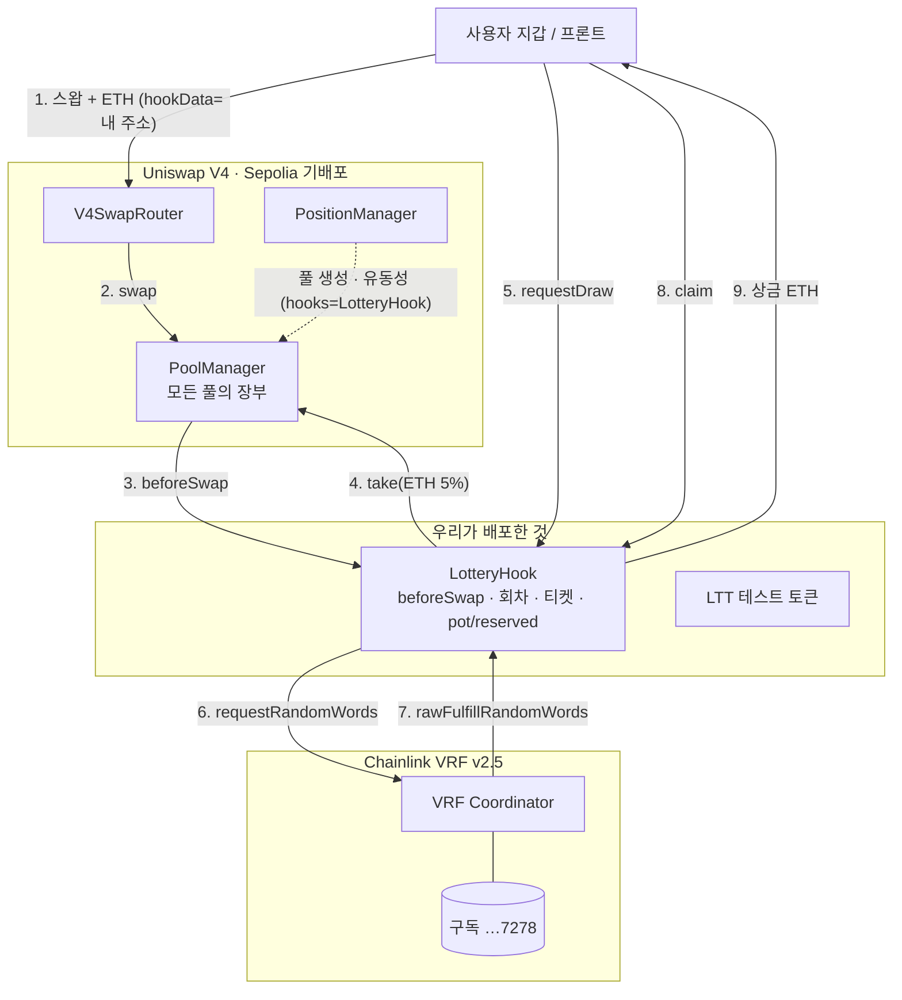
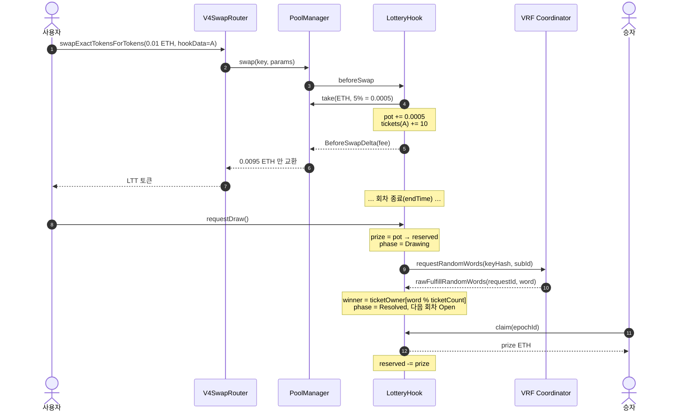
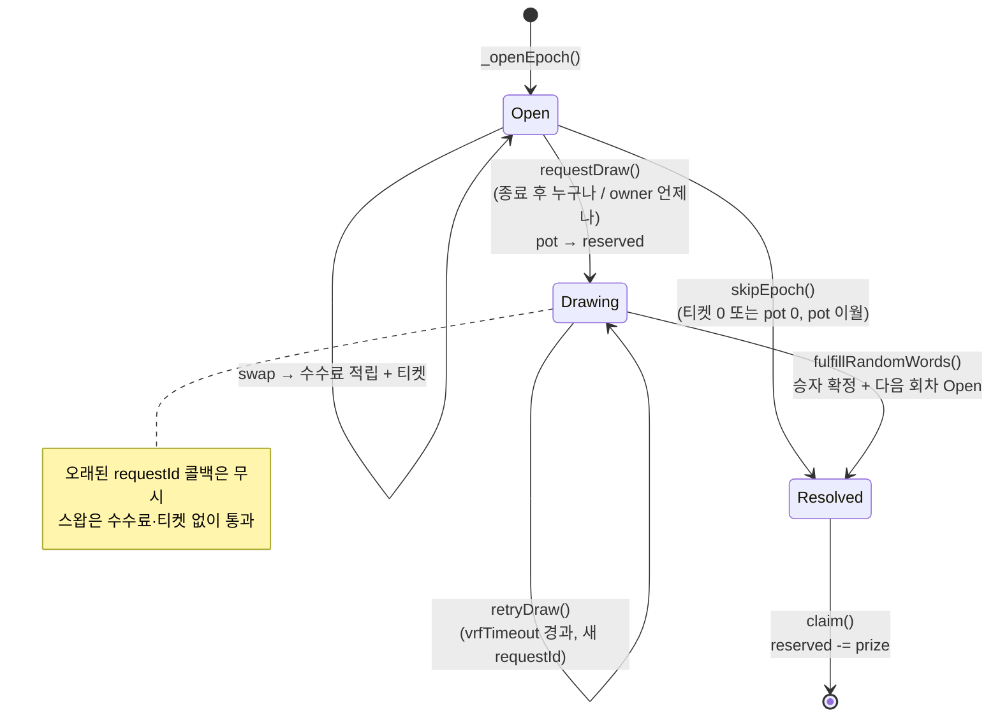
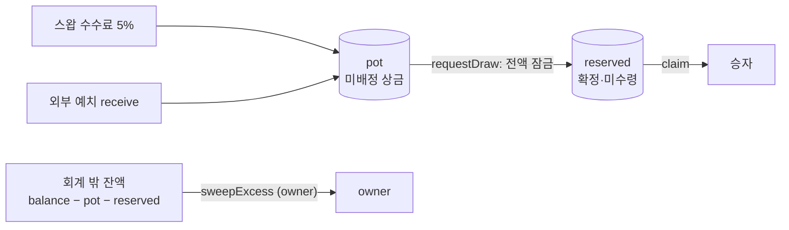

# LotteryHook — Uniswap V4 + Chainlink VRF v2.5

ETH 스왑마다 입력 금액의 5%를 상금 풀에 넣고 0.001 ETH당 티켓 1장을 발급합니다. 회차가 끝나면 Chainlink VRF로 1명을 뽑아 모인 상금을 지급합니다. 상금은 참가자 수수료로만 만들어집니다.

**감사받지 않은 학습용 코드입니다. 메인넷에 돈을 넣지 마세요.**

## 구조

- `src/LotteryHook.sol` — BaseHook(beforeSwap + returnDelta) + VRFConsumerBaseV2Plus
- `src/mocks/MockVRFCoordinatorV2Plus.sol` — Foundry mock
- `test/LotteryHook.t.sol` — ETH/토큰 풀 기준 36개
- `script/DeploySepolia.s.sol` — 토큰·훅·풀·상금·VRF consumer 원샷 배포

## 구조도

### 컨트랙트 구성



### 한 회차의 흐름



### 회차 상태 머신



### 상금 회계



## 폴더 구조

```
lottery-v4-hook/        ← 여기서 forge build / forge test
├── src/LotteryHook.sol
├── src/mocks/MockVRFCoordinatorV2Plus.sol
├── test/LotteryHook.t.sol
├── test/utils/          ← v4-template 에서 가져온 테스트 헬퍼
├── script/DeployLotteryHook.s.sol
├── foundry.toml         ← libs = ["v4-template/lib"]
├── remappings.txt
├── v4-template/lib/     ← 의존성 전용 (uniswap-hooks, chainlink, forge-std)
└── web/                 ← React + Three.js 프론트 (web/README.md 참고)
```

## 프론트엔드

```bash
cd web && npm install && npm run dev
```

훅 주소를 `.env` 에 넣기 전까지는 데모 모드로 동작합니다. 라이브 페이지(3D 추첨 드럼, 참여/추첨/수령)와
작동 원리 페이지(컨트랙트 호출 흐름 온보딩)가 있습니다.

## 설치

```bash
git clone https://github.com/uniswapfoundation/v4-template.git
cd v4-template && forge install && forge install smartcontractkit/chainlink-brownie-contracts && cd ..
forge build
forge test --match-contract LotteryHookTest -vv
```

`v4-template` 안에는 `lib` 만 쓰고 나머지(예제 Counter 등)는 지워도 됩니다.

## 동작

1. 사용자가 ETH → 토큰 스왑을 보낸다 (`hookData = abi.encode(player)` 로 플레이어 지정)
2. `beforeSwap` 이 입력 ETH 의 `feeBps`(기본 5%) 를 `poolManager.take` 로 가져가 `pot` 에 쌓고, 금액 ÷ `ticketPrice`(기본 0.001 ETH) 장의 티켓을 발급한다. 풀은 나머지만 교환한다
   - ETH 를 넣는 exact-input 스왑만 참가. 토큰→ETH, exact-output, 회차 닫힘, 금액 미달이면 수수료 없이 통과. 절대 revert 하지 않음
   - 티켓은 스왑당 누적 구간 하나로 저장(SSTORE 1회). 당첨 인덱스는 이진 탐색
3. 누구나 훅 주소로 ETH 를 보내 상금을 보탤 수도 있다 (선택)
4. epoch 종료 후 `requestDraw()` 또는 Chainlink Automation `performUpkeep`
   - 이 시점에 `pot` 전체가 해당 회차 상금으로 확정되어 `reserved` 로 옮겨진다
   - 티켓이 없거나 `pot` 이 0이면 `skipEpoch()` 으로 회차를 닫고 `pot` 은 이월
5. VRF 콜백이 승자 확정 후 바로 다음 회차를 연다 (승자의 claim 과 무관)
   - 콜백이 `vrfTimeout`(기본 1일) 안에 안 오면 `retryDraw()` 로 재요청. 이전 요청의 콜백은 무시
6. 승자가 `claim(epochId)` 로 ETH 수령. 미수령 상금은 다음 회차 상금에 섞이지 않는다

관리자 설정: `setFeeBps`(최대 20%), `setTicketPrice`, `setEpochDuration`, `setAllowedPool`, `setVrfConfig`.

## 상금 회계

- `pot`: 아직 배정되지 않은 상금. 다음 추첨에 걸린다
- `reserved`: 추첨 중이거나 확정됐지만 미수령인 상금 합계
- `balance - pot - reserved` 만 owner 가 `sweepExcess()` 로 회수 가능. 플레이어 상금은 owner 도 못 꺼낸다

## 소유권

Chainlink `ConfirmedOwner` 는 생성자의 `msg.sender` 를 owner 로 잡는다. CREATE2 프록시로 배포하면 프록시가 owner 가 되므로,
생성자 마지막 인자 `_owner` 로 소유권을 제안하고 배포 후 `_owner` 가 `acceptOwnership()` 을 호출해야 한다.
배포 스크립트는 브로드캐스터와 `HOOK_OWNER` 가 같으면 자동으로 accept 한다.

## Sepolia 배포

```bash
cp .env.example .env     # PRIVATE_KEY, VRF_SUBSCRIPTION_ID 채우기
source .env
forge script script/DeploySepolia.s.sol --rpc-url sepolia --broadcast --private-key $PRIVATE_KEY -vv
cd web && npm run sync-env && npm run dev
```

스크립트 하나가 다음을 한 트랜잭션 묶음으로 처리합니다.

1. 테스트 토큰(LTT) 배포 + 배포자에게 민팅
2. AFTER_SWAP 플래그 주소를 CREATE2 로 채굴해 LotteryHook 배포, `acceptOwnership`, 회차 길이 설정
3. ETH/LTT 풀 생성(1:1) + 유동성 `LIQUIDITY_ETH` 만큼 추가
4. `setAllowedPool` 로 훅에 풀 연결
5. `PRIZE_ETH` 만큼 첫 상금 예치
6. `VRF_ADD_CONSUMER=true` 면 훅을 VRF 구독 consumer 로 등록 (배포자가 구독 owner 여야 함)
7. `deployments/sepolia.json` 기록 → `npm run sync-env` 가 `web/.env` 생성

Uniswap 주소는 hookmate `AddressConstants` 가 chainid 로 고르므로 `--rpc-url` 만 바꾸면 Base Sepolia, Arbitrum Sepolia 에도 그대로 씁니다.

### 데모용 mock VRF 전환 (LINK 가 부족할 때)

Sepolia 노드는 구독 잔액이 "최악 비용"(750 gwei 레인 기준, 콜백 120k 면 약 45~60 LINK) 이상일 때만 이행한다.
faucet 25 LINK 로는 부족하므로, 데모 때는 훅의 코디네이터를 mock 으로 바꿔 owner 가 난수를 직접 주입한다.

```bash
forge create src/mocks/MockVRFCoordinatorV2Plus.sol:MockVRFCoordinatorV2Plus --rpc-url sepolia --private-key $PRIVATE_KEY --broadcast
cast send <hook> "setCoordinator(address)" <mock> --rpc-url sepolia --private-key $PRIVATE_KEY
# 이후 프론트의 "난수 주입하고 승자 뽑기" 버튼 (owner) 또는:
cast send <mock> "fulfill(uint256,uint256)" <requestId> <randomWord> --rpc-url sepolia --private-key $PRIVATE_KEY
```

프론트는 훅의 `s_vrfCoordinator` 가 `.env` 의 `VITE_VRF_COORDINATOR`(진짜 Chainlink) 와 다르면 자동으로 mock 모드 UI 를 띄운다.
LINK 가 모이면 `setCoordinator(<chainlink>)` 로 되돌리면 되고 재배포는 필요 없다. **mock 의 fulfill 은 누구나 호출할 수 있으므로 데모 전용이다.**

### 사전 준비 (VRF 함정 두 가지)

1. **keyHash 는 온체인에서 확인**: `cast call <coordinator> "s_provingKeyHashes(uint256)(bytes32)" 0`. 코디네이터는 요청 시 keyHash 를 검증하지 않아서, 틀린 값이면 요청은 성공하지만 노드가 영원히 이행하지 않는다 (vrf.chain.link 에 "Failed: Invalid key").
2. **잔액은 "최악 비용" 이상이어야 한다**: Sepolia keyHash 는 750 gwei 가스 레인이라 노드가 최악 비용을 750 gwei 기준으로 잡는다 (LINK/ETH 피드 1 ETH≈204 LINK). 콜백 120k 기준 ETH 결제는 약 0.25 ETH, LINK 결제는 약 45~60 LINK 가 있어야 이행되고, 그 이하면 "Pending (low balance)" 로 멈춘다. faucet 은 지갑당 하루 25 LINK 이므로 팀원 2~3명이 각자 받아 같은 구독에 넣으면 된다. 배포 스크립트 기본값은 LINK 결제(`nativePayment=false`).
3. 콜백 실측 가스는 약 3.5만. `callbackGasLimit` 은 12만이면 충분하다.

### 사전 준비

- Sepolia ETH: 유동성 + 상금 + 가스로 0.1 ETH 정도
- [vrf.chain.link](https://vrf.chain.link) 에서 Sepolia 구독 생성 → **LINK 로 충전** (faucet 25 LINK) → 구독 ID를 `VRF_SUBSCRIPTION_ID` 에
- `.env.example` 의 코디네이터/keyHash 는 [docs.chain.link](https://docs.chain.link/vrf/v2-5/supported-networks) 에서 한 번 더 확인

### 로컬 검증 (Sepolia 포크)

```bash
anvil --fork-url https://ethereum-sepolia-rpc.publicnode.com --chain-id 11155111
forge create src/mocks/MockVRFCoordinatorV2Plus.sol:MockVRFCoordinatorV2Plus --rpc-url http://127.0.0.1:8545 --private-key <anvil key> --broadcast
VRF_COORDINATOR=<mock> VRF_SUBSCRIPTION_ID=1 VRF_KEY_HASH=0x00..01 VRF_ADD_CONSUMER=false \
  forge script script/DeploySepolia.s.sol --rpc-url http://127.0.0.1:8545 --private-key <anvil key> --broadcast
```

실제 Sepolia 의 PoolManager, PositionManager, V4SwapRouter 를 그대로 쓰기 때문에 스왑→티켓 발급까지 검증됩니다.

## 아직 안 한 것

- 토큰 → ETH 방향 스왑의 참가 (수수료가 토큰으로 떨어져 상금 통화가 섞이므로 제외)
- Chainlink Automation 등록 (지금은 프론트의 추첨 버튼 또는 수동 호출)
